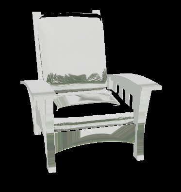
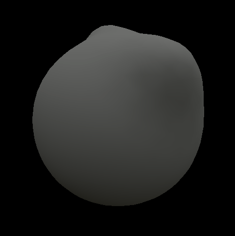
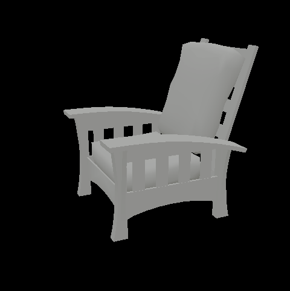
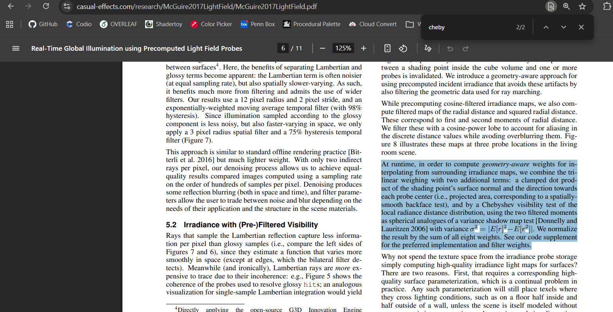

# Realtime Vulkan Global Illumination Renderer
---

This is a renderer written with Vulkan that will support global illumination through diffuse irradiance probes and some TBD specular technique.

For this milestone, I spent a lot of time learning Vulkan and setting up the renderer.  I implemented textures and obj loading.  

Chair w/ Point Lights, Albedo Map, Roughness & Metallic Map

Different albedos, roughnesses, and metallnesses on a blob.

After implementing point lights, I refactored the engine into classes like Texture, Material, and Shader, to make asset management easier.  Next, I will implement a naive triangle raytracer on the GPU, then I'll implement a PBRT based BVH for it, and then I'll implement irradiance probes that store diffuse convolution information with spherical harmonics.  I'll try to use that same spherical harmonics method to get a diffuse convolution for IBL.  After getting diffuse lighting working, I'll get specular working with specular convolution and some method like reflection probes or screenspace reflection.

---
## 3/5/2026 Update

- More refactoring for Vulkan Renderer: Mesh, RenderPass, RenderTarget, ComputeDispatcher, ComputeShader, Material classes...
- Naive raytracing of meshes test
- Render Pass & Target setup for rendering to arbitrary textures, setup for deferred rendering
- Diffuse Convolution using Spherical Harmonics (could be made faster using lookup tables for basis functions)

Testing naive raytracing.

Looks weird but it tests using RenderTarget & RenderPass objects to render to cubemap, useful for Specular Image-Based Lighting.  Specifically, render a skybox chair into the skybox's +Y cubemap face, then render the skybox chair using the modified skybox.

---

Rendering the skybox into a sphere.

Rendering blob and chair using Spherical Harmonics Diffuse Convolution with white albedo.

<!-- 

| Skybox | Diffuse Convolution using SH |
| :---: | :---: |
|  |  |

Can bake  -->

---
## 3/18/2026 Update

- Baking many diffuse probes, no longer using float atomics so that the renderer has better compatibility
- More refactoring for Vulkan Renderer
- Render skybox cubemap

80x10x80 probe grid w/ skybox

80x10x80 probe grid w/o skybox

Need to do probe visibility checking & optimize probe bake compute shader, likely through BVH and parallelization.

---
## 3/26/2026 Update

- Camera Controller
- UI Integration
- Uniform Ring Buffer for multiple game objects being stored optimally in same material

---
## Visibility/Weighting Plan

- Max dimensions of texture on device
- Octahedral depth and depth^2 map, big texture atlas, each individual probe takes up 18x18 (including gutters)
- During monte carlo irradiance estimation, for each sample, get depth and depth^2 and project into octahedral map.  In the 16x16 texture, each texel center corresponds to a sphere direction, do a weighted sum on some nearby texels (most accurate to do all, but could do like a 5x5 pixel radius) with max(0, dot(texelCenterDir, sampleRayDir)) as the weight.  Value += weight * sampleVal, totalWeight += weight, then at end Value /= totalWeight.  Do this for both depth and depth^2.  Maybe I should use a buffer to bake and then put it into a texture?
- After we bake the buffer/texture, we can turn it into a gutter texture, where each 16x16 grid is now 18x18 so that when a border texel looks to the outside, it loops back around for bilinear interpolation.
- For sampling probes, instead of trilinear interpolating the sample directly, we can trilinear interpolate a 'trilinear sample weight' so that if we do a weighted sum of the values with this weight, we get the same trilinear interpolated value.  w000 = (1-x) * (1-y) * (1-z)..., then we can tack on other weights easily.
- Other weights in addition to trilinear position weight (shown in below img), are backface weight and visibility weight.  Backface weight is a simple dot product visibility heuristic and visibility weight is the actual bilinear interpolated sample from the depth texture.
- How do we sample the depth textures though?  We have E(depth) and E(depth^2) so we can use that to get variance.  We then use the chebychev inequality so that visibility is smoother for depth samples that have higher variance.

## Addition
- Instead of each compute pass baking lots of rays for a probe, could make it so each compute pass bakes a few rays for each probe.  This avoids the scratch buffer and the atomics since we can just do smth more similar to monte calro pathtracing where we add into the texture each time.