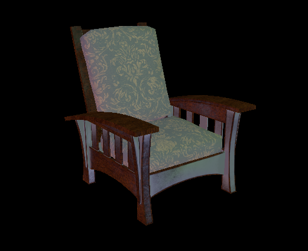
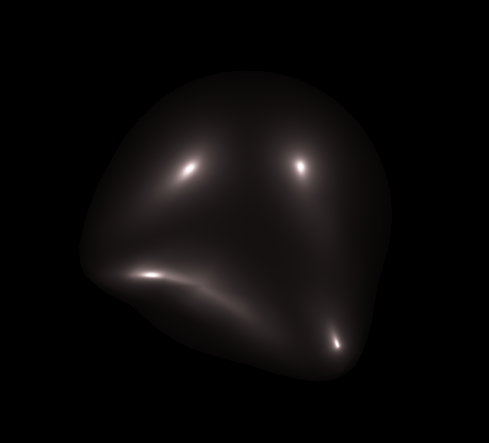
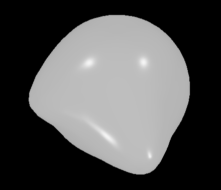
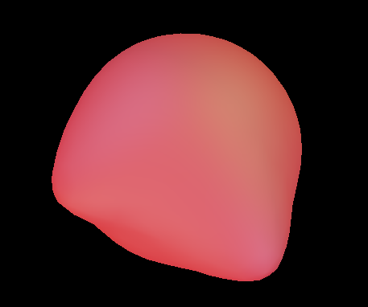

# Realtime Vulkan Global Illumination Renderer
---

This is a renderer written with Vulkan that will support global illumination through diffuse irradiance probes and some TBD specular technique.

For this milestone, I spent a lot of time learning Vulkan and setting up the renderer.  I implemented textures and obj loading.  

Chair w/ Point Lights, Albedo Map, Roughness & Metallic Map

Different albedos, roughnesses, and metallnesses on a blob.

After implementing point lights, I refactored the engine into classes like Texture, Material, and Shader, to make asset management easier.  Next, I will implement a naive triangle raytracer on the GPU, then I'll implement a PBRT based BVH for it, and then I'll implement irradiance probes that store diffuse convolution information with spherical harmonics.  I'll try to use that same spherical harmonics method to get a diffuse convolution for IBL.  After getting diffuse lighting working, I'll get specular working with specular convolution and some method like reflection probes or screenspace reflection.
